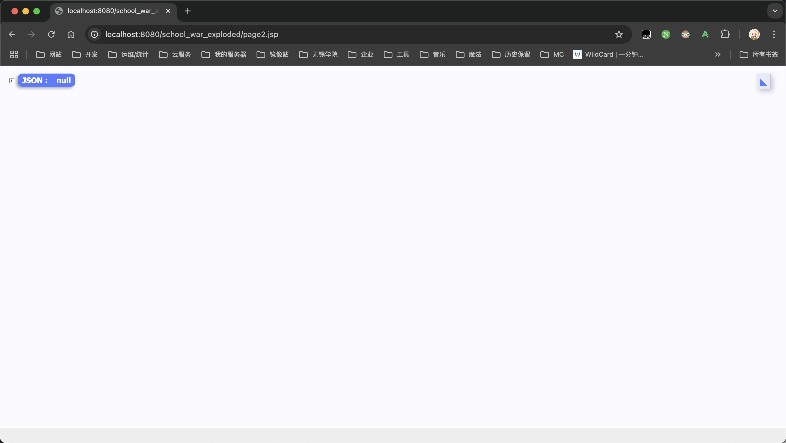
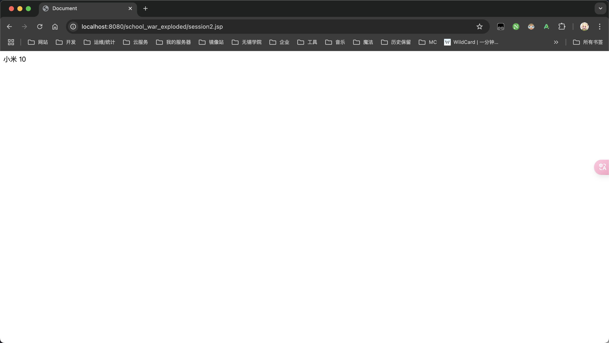
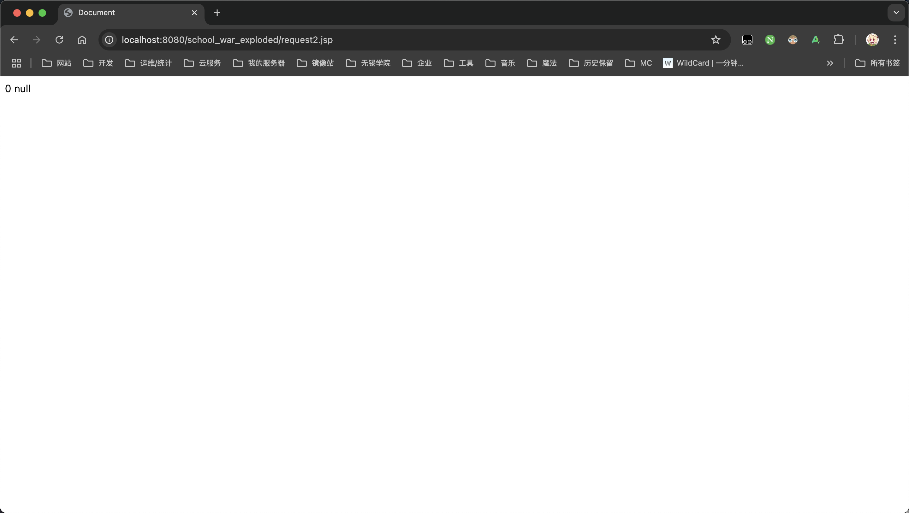
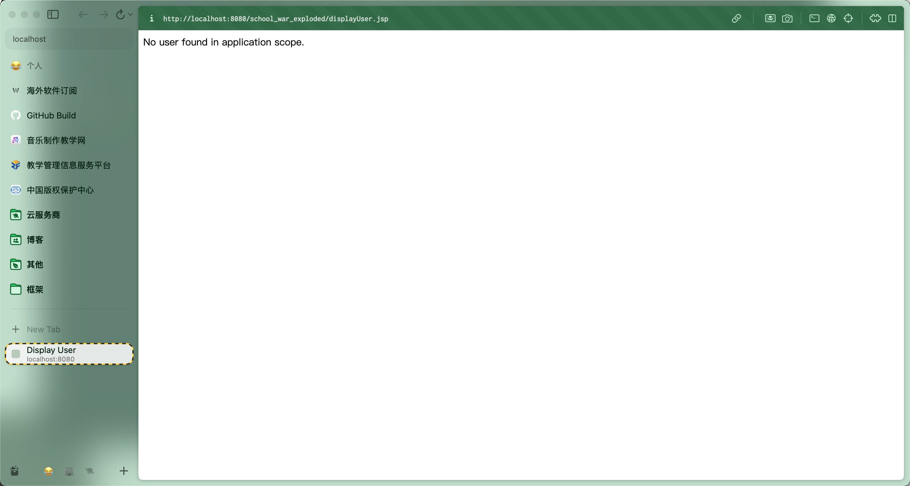
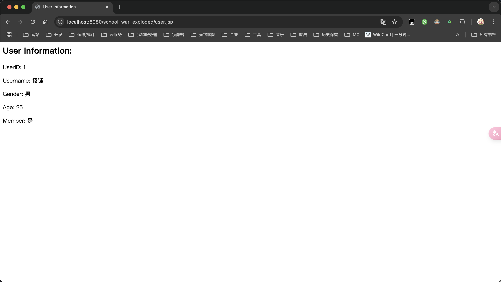
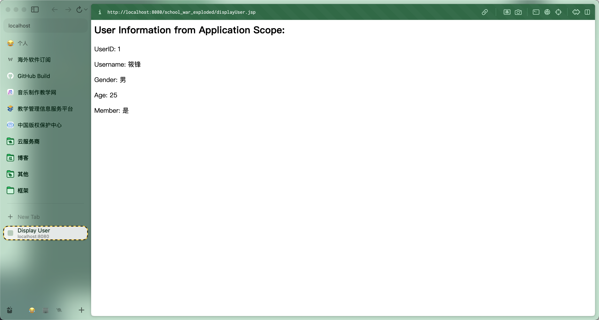
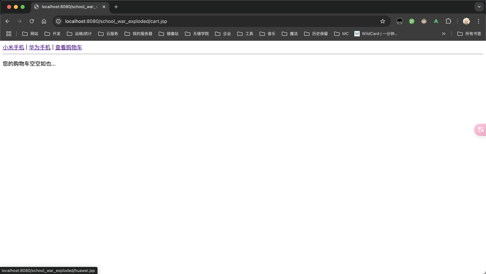
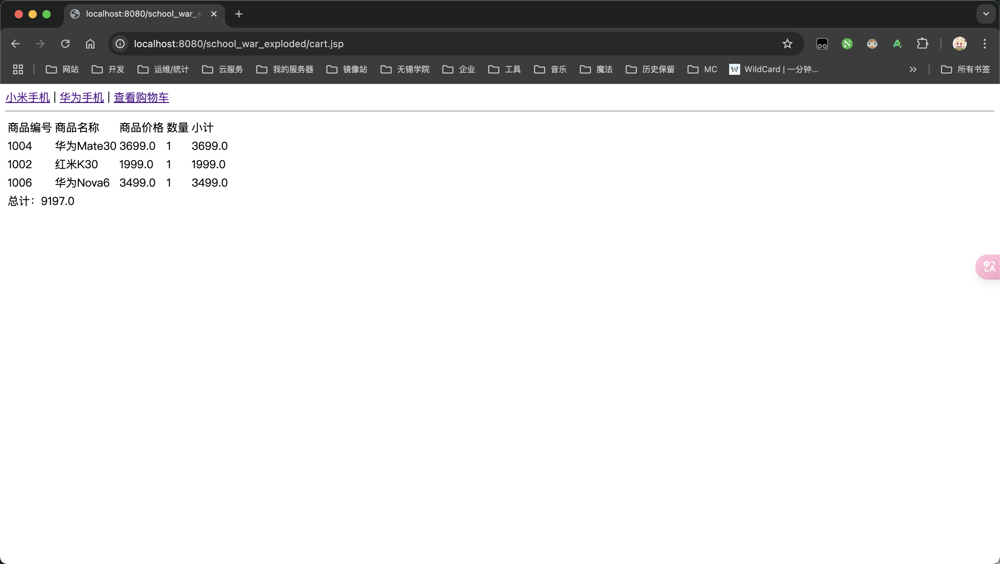

# 实验3 JSP与JavaBean

## 实验目的

1. 掌握 JavaBean相关概念
2. 熟悉 JavaBean的使用
3. 在JSP及Servlet中引入JavaBean对象，设置与读取JavaBean属性的方法，以及讨论JavaBean对象的范围。


## 实验内容

### 1. 完成教材【例6-1】Eclipse中编写JavaBean对象的示例。

#### 源代码

```java
package com.xlf.school.bean;

import java.io.Serial;
import java.io.Serializable;

/**
 * Goods
 * <p>
 * 商品类, 用于存储商品信息
 *
 * @version v1.0.0
 * @since v1.0.0
 * @author xiao_lfeng
 */
public class Goods implements Serializable {
    @Serial
    private static final long serialVersionUID = 0;
    private int gid;
    private String gname;
    private double gprice;
    private int count;

    public int getGid() {
        return gid;
    }

    public void setGid(int gid) {
        this.gid = gid;
    }

    public String getGname() {
        return gname;
    }

    public void setGname(String gname) {
        this.gname = gname;
    }

    public double getGprice() {
        return gprice;
    }

    public void setGprice(double gprice) {
        this.gprice = gprice;
    }

    public int getCount() {
        return count;
    }

    public void setCount(int count) {
        this.count = count;
    }
}
```


### 2. 完成教材的例6-2scope属性使用示例。

> \<jsp:useBean>标签属性scope，表示JavaBean的作用范围，scope属性的候选值可以是以下四个。
>
> （1） page：表示JavaBean对象作用范围仅限于本页面，在别的页面无法识别。
>
> 新建两个JSP页面，分别命名为page1.jsp和page2.jsp。
>
> 在page1.jsp的body标签内编写代码，设置1个page范围内的JavaBean对象goods，并设置属性值gname，然后在该页面直接读取，如图6-3所示。
>
>  
>
> （2） request：表示JavaBean对象除了当前页面可识别外，还可以被request范围内的页面所读取，例如通过forward方式跳转的页面。
>
> （3） session：表示JavaBean对象可以在同一session下所有页面识别。
>
> （4） application：表示只要Web服务器不重启，JavaBean对象能够一直被识别。

#### 源代码

```jsp
<%@ page contentType="text/html; charset=UTF-8" pageEncoding="UTF-8" %>
<!doctype html>
<html lang="zh">
<head>
    <meta charset="UTF-8">
    <meta name="viewport"
          content="width=device-width, user-scalable=no, initial-scale=1.0, maximum-scale=1.0, minimum-scale=1.0">
    <meta http-equiv="X-UA-Compatible" content="ie=edge">
    <title>Document</title>
</head>
<body>
<jsp:useBean id="goods" class="com.xlf.school.bean.Goods" scope="page">

</jsp:useBean>

<jsp:setProperty property="gname" name="goods" value="小米 10"/>
<jsp:getProperty name="goods" property="gname"/>
</body>
</html>
```

```jsp
<%@ page contentType="text/html; charset=UTF-8" pageEncoding="UTF-8" %>
<!doctype html>
<html lang="zh">
<head>
    <meta charset="UTF-8">
    <meta name="viewport"
          content="width=device-width, user-scalable=no, initial-scale=1.0, maximum-scale=1.0, minimum-scale=1.0">
    <meta http-equiv="X-UA-Compatible" content="ie=edge">
    <title>Document</title>
</head>
<body>
<jsp:useBean id="goods" class="com.xlf.school.bean.Goods" scope="page">

</jsp:useBean>

<jsp:getProperty name="goods" property="gname"/>
</body>
</html>
```

```jsp
<%@ page contentType="text/html;charset=UTF-8" language="java" %>
<!doctype html>
<html lang="zh">
<head>
    <meta charset="UTF-8">
    <meta name="viewport"
          content="width=device-width, user-scalable=no, initial-scale=1.0, maximum-scale=1.0, minimum-scale=1.0">
    <meta http-equiv="X-UA-Compatible" content="ie=edge">
    <title>Document</title>
</head>
<body>
<jsp:useBean id="goods" class="com.xlf.school.bean.Goods" scope="request">

</jsp:useBean>

<jsp:setProperty property="gname" name="goods" value="小米 10"/>
<jsp:forward page="request2.jsp?gid=1001"/>
</body>
</html>
```

```jsp
<%@ page contentType="text/html;charset=UTF-8" language="java" %>
<!doctype html>
<html lang="zh">
<head>
    <meta charset="UTF-8">
    <meta name="viewport"
          content="width=device-width, user-scalable=no, initial-scale=1.0, maximum-scale=1.0, minimum-scale=1.0">
    <meta http-equiv="X-UA-Compatible" content="ie=edge">
    <title>Document</title>
</head>
<body>
<jsp:useBean id="goods" class="com.xlf.school.bean.Goods" scope="request">

</jsp:useBean>

<jsp:setProperty name="goods" property="gid" param="gid"/>
<jsp:getProperty name="goods" property="gid"/>

<jsp:getProperty name="goods" property="gname"/>
</body>
</html>
```

```jsp
<%@ page contentType="text/html;charset=UTF-8" language="java" %>
<!doctype html>
<html lang="zh">
<head>
  <meta charset="UTF-8">
  <meta name="viewport"
        content="width=device-width, user-scalable=no, initial-scale=1.0, maximum-scale=1.0, minimum-scale=1.0">
  <meta http-equiv="X-UA-Compatible" content="ie=edge">
  <title>Document</title>
</head>
<body>
<jsp:useBean id="goods" class="com.xlf.school.bean.Goods" scope="session"/>
<jsp:setProperty property="gname" name="goods" value="小米 10"/>
</body>
</html>
```

```jsp
<%@ page contentType="text/html;charset=UTF-8" language="java" %>
<!doctype html>
<html lang="zh">
<head>
    <meta charset="UTF-8">
    <meta name="viewport"
          content="width=device-width, user-scalable=no, initial-scale=1.0, maximum-scale=1.0, minimum-scale=1.0">
    <meta http-equiv="X-UA-Compatible" content="ie=edge">
    <title>Document</title>
</head>
<body>
<jsp:useBean id="goods" class="com.xlf.school.bean.Goods" scope="session">

</jsp:useBean>

<jsp:getProperty name="goods" property="gname"/>
</body>
</html>
```


#### 截图









### 3. 下面要求完成JSP项目开发，具体如下

> （1）按照JavaBean的编写规范，编写一个User.java的类，含有用户序号userid、用户名username、性别gender、年龄age，并编写对应属性的getter/setter方法。
>
> （2）在上一题编写的User类中，增加一个Boolean类型的属性member，该属性用于判断是否用户为会员，利用Eclipse代码生成编写对应的getter/setter方法。然后在JSP页面中引入User对象，对所有属性进行设置，并利用标签语句输出所有属性值。 
>
> （3）在第一个JSP页面中引入User对象，对所有属性进行设置，并将scope取值为application，然后新建第二个JSP页面访问User对象。注意：首先使用一种浏览器访问第一个页面，然后使用另外一种浏览器访问第二个JSP页面，查看其效果。

#### 源代码

```java
package com.xlf.school.bean;

/**
 * User
 * <p>
 * 用户实体类，用于存储用户信息
 *
 * @version v1.0.0
 * @since v1.0.0
 * @author xiao_lfeng
 */
public class User {
    private int userid;
    private String username;
    private String gender;
    private int age;
    private Boolean member;

    public int getUserid() {
        return userid;
    }

    public void setUserid(int userid) {
        this.userid = userid;
    }

    public String getUsername() {
        return username;
    }

    public void setUsername(String username) {
        this.username = username;
    }

    public String getGender() {
        return gender;
    }

    public void setGender(String gender) {
        this.gender = gender;
    }

    public int getAge() {
        return age;
    }

    public void setAge(int age) {
        this.age = age;
    }

    public Boolean getMember() {
        return member;
    }

    public void setMember(Boolean member) {
        this.member = member;
    }
}
```

```jsp
<%@ page language="java" contentType="text/html; charset=UTF-8" pageEncoding="UTF-8"%>
<%@ page import="com.xlf.school.bean.User" %>
<html>
<head>
  <title>User Information</title>
</head>
<body>
<%
  User user = new User();
  user.setUserid(1);
  user.setUsername("筱锋");
  user.setGender("男");
  user.setAge(21);
  user.setMember(true);

  application.setAttribute("user", user);
%>

<h2>User Information:</h2>
<p>UserID: <%= user.getUserid() %></p>
<p>Username: <%= user.getUsername() %></p>
<p>Gender: <%= user.getGender() %></p>
<p>Age: <%= user.getAge() %></p>
<p>Member: <%= user.getMember() ? "是" : "否" %></p>
</body>
</html>
```

```jsp
<%@ page language="java" contentType="text/html; charset=UTF-8" pageEncoding="UTF-8"%>
<%@ page import="com.xlf.school.bean.User" %>
<html>
<head>
  <title>Display User</title>
</head>
<body>
<%
  User user = (User) application.getAttribute("user");

  if (user != null) {
%>
<h2>User Information from Application Scope:</h2>
<p>UserID: <%= user.getUserid() %></p>
<p>Username: <%= user.getUsername() %></p>
<p>Gender: <%= user.getGender() %></p>
<p>Age: <%= user.getAge() %></p>
<p>Member: <%= user.getMember() ? "是" : "否" %></p>
<%
} else {
%>
<p>No user found in application scope.</p>
<%
  }
%>
</body>
</html>
```


#### 截图








### 4. 完成【例6-3】利用JavaBean开发简易购物车的示例

> 简易购物车的要求是：网站可以购买不同品牌的手机商品，每个品牌的页面中显示不同型号手机的名称和价格，在商品后面可以选择购买的数量，并显示购买的超链接，单击超链接，可以将商品加入用户的购物车中。在不同的页面下，可以自由挑选商品加入购物车，最终显示购物车内手机商品的数量，每种型号手机的个数、小计价格以及整个购物车商品的价格。

```java
package com.xlf.school.bean;

import java.io.Serial;
import java.io.Serializable;

/**
 * Goods
 * <p>
 * 商品类, 用于存储商品信息
 *
 * @version v1.0.0
 * @since v1.0.0
 * @author xiao_lfeng
 */
public class Goods implements Serializable {
    @Serial
    private static final long serialVersionUID = 0;
    private int gid;
    private String gname;
    private double gprice;
    private int gcount;

    public int getGid() {
        return gid;
    }

    public void setGid(int gid) {
        this.gid = gid;
    }

    public String getGname() {
        return gname;
    }

    public void setGname(String gname) {
        this.gname = gname;
    }

    public double getGprice() {
        return gprice;
    }

    public void setGprice(double gprice) {
        this.gprice = gprice;
    }

    public int getGcount() {
        return gcount;
    }

    public void setGcount(int gcount) {
        this.gcount = gcount;
    }
}
```

```java
package com.xlf.school;

import com.xlf.school.bean.Goods;
import jakarta.servlet.ServletException;
import jakarta.servlet.annotation.WebServlet;
import jakarta.servlet.http.HttpServlet;
import jakarta.servlet.http.HttpServletRequest;
import jakarta.servlet.http.HttpServletResponse;
import jakarta.servlet.http.HttpSession;

import java.io.IOException;

/**
 * 添加购物车 Servlet
 * <p>
 * 用于处理添加购物车请求
 *
 * @author xiao_lfeng
 * @version v1.0.0
 * @since v1.0.0
 */
@WebServlet(name = "AddCartServlet", urlPatterns = "/AddCartServlet")
public class AddCartServlet extends HttpServlet {
    @Override
    protected void doGet(HttpServletRequest request, HttpServletResponse response)
            throws ServletException, IOException {
        response.setCharacterEncoding("UTF-8");
        response.setHeader("Content-type", "text/html; charset=UTF-8");

        String gid = request.getParameter("gid");
        String gcount = request.getParameter("gcount");

        if (gid != null && gcount != null) {
            Goods goods;
            GoodsDao goodsDao = new GoodsDao();

            goods = goodsDao.setGoods(Integer.parseInt(gid));
            goods.setGcount(Integer.parseInt(gcount));

            HttpSession session = request.getSession();
            Cart cart = (Cart) session.getAttribute("cart");

            if (cart != null) {
                cart.addGoods(goods);
            } else {
                cart = new Cart();
                cart.addGoods(goods);
            }

            session.setAttribute("cart", cart);
            response.getWriter().println("添加成功！");
            response.getWriter().println("<a href='cart.jsp'>查看购物车</a>");
            response.getWriter().println("<a href='javascript:history.back(-1)'>返回上一页</a>");
        } else {
            response.getWriter().println("参数不正确");
            response.getWriter().println("<a href='javascript:history.back(-1)'>返回上一页</a>");
        }
    }
}
```

```java
package com.xlf.school;

import com.xlf.school.bean.Goods;

import java.io.Serial;
import java.util.ArrayList;
import java.io.Serializable;

/**
 * 购物车类
 * <p>
 * 用于存储用户购物车信息
 *
 * @version v1.0.0
 * @since v1.0.0
 * @author xiao_lfeng
 */
public class Cart implements Serializable {
    @Serial
    private static final long serialVersionUID = 44256950914898900L;
    private ArrayList<Goods> goodslist = new ArrayList<>();

    public ArrayList<Goods> getGoodslist() {
        return goodslist;
    }

    public void setGoodslist(ArrayList<Goods> goodslist) {
        this.goodslist = goodslist;
    }

    public int getGcount() {
        int count = 0;
        for (Goods g : goodslist) {
            count += g.getGcount();
        }
        return count;
    }

    public double getTotal() {
        double sum = 0;
        for (Goods g : goodslist) {
            sum += g.getGprice() * g.getGcount();
        }
        return sum;
    }

    public int check(int gid) {
        for (int i = 0; i < goodslist.size(); i++) {
            if (goodslist.get(i).getGid() == gid) {
                return i;
            }
        }
        return -1;
    }

    public void addGoods(Goods goods) {
        int index = check(goods.getGid());
        if (index == -1) {
            goodslist.add(goods);
        } else {
            Goods g = goodslist.get(index);
            g.setGcount(g.getGcount() + goods.getGcount());
        }
    }
}
```

```java
package com.xlf.school;

import com.xlf.school.bean.Goods;

/**
 * 商品信息 Dao
 * <p>
 * 用于获取商品信息
 *
 * @version v1.0.0
 * @since v1.0.0
 * @author xiao_lfeng
 */
public class GoodsDao {
    public Goods setGoods(int gid) {
        Goods goods = new Goods();

        switch (gid) {
            case 1001:
                goods.setGid(1001);
                goods.setGname("小米10");
                goods.setGprice(3999.00);
                break;
            case 1002:
                goods.setGid(1002);
                goods.setGname("红米K30");
                goods.setGprice(1999.00);
                break;
            case 1003:
                goods.setGid(1003);
                goods.setGname("红米Note8");
                goods.setGprice(999.00);
                break;
            case 1004:
                goods.setGid(1004);
                goods.setGname("华为Mate30");
                goods.setGprice(3699.00);
                break;
            case 1005:
                goods.setGid(1005);
                goods.setGname("华为P40");
                goods.setGprice(4188.00);
                break;
            case 1006:
                goods.setGid(1006);
                goods.setGname("华为Nova6");
                goods.setGprice(3499.00);
                break;
            default:
                // 可以添加默认处理
                break;
        }

        return goods;
    }
}
```

```jsp
<%@ page language="java" contentType="text/html; charset=UTF-8" pageEncoding="UTF-8"%>
<%@ include file="header.jsp" %>
<%@ page import="com.xlf.school.Cart, com.xlf.school.bean.Goods, java.util.ArrayList" %>
<%@ page import="com.xlf.school.bean.Goods" %>
<jsp:useBean id="cart" class="com.xlf.school.Cart" scope="session"/>
<%
  if (cart == null || cart.getGoodslist().size() == 0) {
%>
<p>您的购物车空空如也...</p>
<%
} else {
  ArrayList<Goods> goodslist = cart.getGoodslist();
  double total = cart.getTotal();
%>
<table>
  <tr>
    <td>商品编号</td>
    <td>商品名称</td>
    <td>商品价格</td>
    <td>数量</td>
    <td>小计</td>
  </tr>
  <%
    for (Goods goods : goodslist) {
  %>
  <tr>
    <td><%= goods.getGid() %></td>
    <td><%= goods.getGname() %></td>
    <td><%= goods.getGprice() %></td>
    <td><%= goods.getGcount() %></td>
    <td><%= goods.getGprice() * goods.getGcount() %></td>
  </tr>
  <% } %>
  <tr>
    <td colspan="5">总计：<%= total %></td>
  </tr>
</table>
<% } %>
```

```jsp
<%@ page language="java" contentType="text/html; charset=UTF-8" pageEncoding="UTF-8"%>
<%@ include file="header.jsp" %>
<table>
  <tr><td>商品号</td><td>商品名称</td><td>商品价格</td><td>数量</td></tr>
  <tr>
    <td>1004</td><td>华为Mate30</td><td>3699.00</td>
    <td><input type="number" name="1004" min="1" value="1" size="5"/></td>
    <td><a class="link" id="1004">加入购物车</a></td>
  </tr>
  <tr>
    <td>1005</td><td>华为P40</td><td>4188.00</td>
    <td><input type="number" name="1005" min="1" value="1" size="5"/></td>
    <td><a class="link" id="1005">加入购物车</a></td>
  </tr>
  <tr>
    <td>1006</td><td>华为Nova6</td><td>3499.00</td>
    <td><input type="number" name="1006" min="1" value="1" size="5"/></td>
    <td><a class="link" id="1006">加入购物车</a></td>
  </tr>
</table>
<script src="addcart.js"></script>
```

```jsp
<%@ page language="java" contentType="text/html; charset=UTF-8" pageEncoding="UTF-8"%>
<%@ include file="header.jsp" %>
<table>
  <tr><td>商品号</td><td>商品名称</td><td>商品价格</td><td>数量</td></tr>
  <tr>
    <td>1001</td><td>小米10</td><td>3999.00</td>
    <td><input type="number" name="1001" min="1" value="1" size="5"/></td>
    <td><a class="link" id="1001">加入购物车</a></td>
  </tr>
  <tr>
    <td>1002</td><td>红米K30</td><td>1999.00</td>
    <td><input type="number" name="1002" min="1" value="1" size="5"/></td>
    <td><a class="link" id="1002">加入购物车</a></td>
  </tr>
  <tr>
    <td>1003</td><td>红米Note8</td><td>999.00</td>
    <td><input type="number" name="1003" min="1" value="1" size="5"/></td>
    <td><a class="link" id="1003">加入购物车</a></td>
  </tr>
</table>
<script src="addcart.js"></script>
```

```jsp
<%@ page language="java" contentType="text/html; charset=UTF-8" pageEncoding="UTF-8"%>
<a href="xiaomi.jsp">小米手机</a> | <a href="huawei.jsp">华为手机</a> | <a href="cart.jsp">查看购物车</a>
<hr>
```

```js
var links = document.getElementsByClassName("link");
for (var i = 0; i < links.length; i++) {
    links[i].onclick = function() {
        var gid = this.id;
        var num = document.getElementsByName(gid)[0].value;
        window.location.href = "AddCartServlet?gid=" + gid + "&gcount=" + num;
    };
}
```


#### 截图



